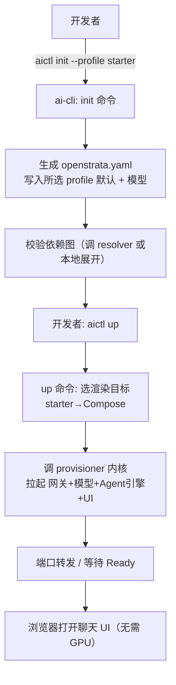
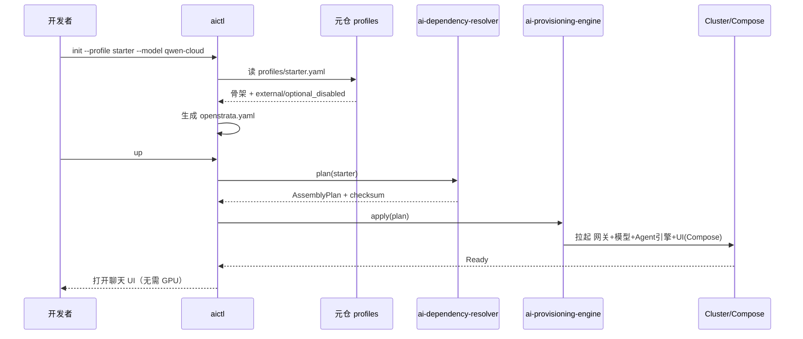

# ai-cli · 详细设计

> **repo**: ai-cli
> **语言·框架**: Go · Cobra + Wire（DDD 四层；CLI 单一二进制）
> **领域**: developer-tooling（开发者工具链）
> **optional**: false（核心 · core，开发者入口）
> **平台版本**: v1.4.0
> **文档状态**: 草稿
> **负责人**: OpenStrata 架构组
> **关联链接**: 本仓 [arch/ARCH.md](../../arch/ARCH.md) · [skills/SKILLS.md](../../skills/SKILLS.md) · [specs/SPECS.md](../../specs/SPECS.md) ；架构设计文档 §4.1.3（SDK 与 CLI · aictl）· §13.4（一键尝鲜）· §12.2（四档预制）· §13.3（装配编排）· §15.6（DDD 分层 / Cobra）· §16（BOM）

---

## 1. 定位与边界（Scope）

`ai-cli`（二进制名 `aictl`）是 OpenStrata 面向**开发者与自动化**的统一命令行入口，承载 §4.1.3「CLI（Go/Cobra）」与 §13.4「一键尝鲜」。它把"本地开发/调试"与"与平台交互（装配、部署、评测、配置）"收敛到一个命令面，对上层用户屏蔽引导门户之外的全部底层操作。

- **本仓解决的唯一问题**：让开发者用一条命令完成"从 0 拉起平台 → 管理模型/应用 → 跑评测 → 改配置 → 触发自动升级"，无需手拼 Helm Values 或理解九层架构。
- **必选性**：core（§4.1.3）。是"做自动化"的用户入口；与低代码工作台（业务人员）、SDK（写代码）并列三类接入方式。
- **与其他 Go 组件的分工**：
  - **vs ai-gateway-core / ai-tool-registry 等运行时**：CLI 是它们的**调用方/驱动方**，不经 CLI 走运行时数据面；CLI 通过它们暴露的 API/控制面交互。
  - **vs ai-dependency-resolver / ai-provisioning-engine**：CLI 的 `plan`/`up`/`apply`/`rollback` 子命令透传调用这两者的内核（§13.3 装配链路）。
  - **vs ai-sdk-go**：SDK 是嵌入宿主应用的库；CLI 是独立可执行，二者都消费 `Gateway`/`LLMProvider` SPI 但形态不同。

---

## 2. 职责清单

| # | 职责 | 必选/可选 | 说明 |
| --- | --- | --- | --- |
| R1 | 引导式初始化 | core | `aictl init --profile starter --model qwen-cloud`（§13.4） |
| R2 | 一键拉起 | core | `aictl up`：Compose/K8s 拉起核心组件（§13.4） |
| R3 | 装配编排透传 | core | `plan`/`apply`/`rollback` → resolver/provisioner（§13.3） |
| R4 | 模型管理 | core | 列出/启用/禁用模型供应方（对接网关） |
| R5 | 应用部署 | core | 部署/调试 Agent（对接 ai-platform-api） |
| R6 | 评测任务 | optional | 提交/查询评测任务（对接 ai-eval-service，§4.6） |
| R7 | 配置管理 | core | 读写 PlatformManifest（openstrata.yaml，§12.1） |
| R8 | 本地调试 | core | 本地起最小运行时、端口转发、日志跟踪 |

---

## 3. 核心抽象与接口（core interfaces / 类型定义）

CLI 以 **Cobra 命令树** + **应用层用例**组织（§15.6.2）；命令不直接依赖具体服务，经 domain Port 调用。

```go
package domain

// 命令上下文：聚合本次调用的能力端口
type CLIContext struct {
    Profile   string // starter|standard|advanced|full
    Manifest  ManifestRef
    Endpoint  string // 平台控制面地址（本地或远程）
}

// 与平台交互的端口（防腐层在 infrastructure 实现）
type PlatformClient interface {
    Init(ctx context.Context, profile, model string) error
    Up(ctx context.Context, profile string) error
    Plan(ctx context.Context, enable []string, tenant string) (string, error) // 返回 checksum
    Apply(ctx context.Context, checksum string) error
    Rollback(ctx context.Context, component string) error
    ListModels(ctx context.Context) ([]ModelView, error)
    DeployApp(ctx context.Context, specPath string) error
    RunEval(ctx context.Context, taskPath string) (string, error)
}

type ModelView struct {
    ModelID string
    Source  string
    Enabled bool
    Health  string
}

// Cobra 命令仅做参数解析 + 调 PlatformClient，不含业务规则
```

---

## 4. 处理流水线 / 请求路径

以 `aictl init --profile starter --model qwen-cloud && aictl up` 为例（§13.4）：



> 本地开发与平台交互两条路径：本地调试走 `up`（Compose 单机）；远程交互走 `plan/apply/rollback`（对接 resolver/provisioner，§13.3）。

---

## 5. 关键算法 / 逻辑

### 5.1 引导式初始化
`init` 读取 `openstrata-meta/profiles/<profile>.yaml` 骨架（§12.2），合并用户 `--model` 选择，生成 `openstrata.yaml`（PlatformManifest）。默认值来自 profile 的 `external` 与 `optional_disabled`（§12.2）。

### 5.2 一键拉起
`up` 据 profile 选渲染目标：starter→Docker Compose；standard+/advanced/full→Helm/K8s（经 provisioner 内核）。完成后自动端口转发并探测 Ready（§13.4「30 秒内拉起」）。

### 5.3 装配透传
`plan/apply/rollback` 将请求转发至 `ai-dependency-resolver` / `ai-provisioning-engine`（§13.3），CLI 仅负责参数收集、进度展示、结果格式化。

### 5.4 配置读写
读写 `openstrata.yaml` 时做 schema 校验（对齐 §12.1），非法即报错，避免脏配置下发。

---

## 6. 与外部系统/组件的适配（OSS / SPI Adapter）

| SPI 端口 | 本仓角色 | 外部组件 | 默认 ✅ / 备选 | Adapter |
| --- | --- | --- | --- | --- |
| `PlatformClient` | 调用方 | `ai-dependency-resolver` / `ai-provisioning-engine` / `ai-platform-api` / `ai-gateway-core` | ✅ | HTTP/gRPC 客户端 Adapter |
| `Gateway` (1.2.0) | 调用方 | Higress（core，数据面） | ✅ | `GatewayClient`（OpenAI-compatible） |
| `LLMProvider` (1.0.0) | 间接 | 各模型供应方 | ✅ | 经网关转发 |
| `Cache` (1.0.0) | 消费方 | Redis（core） | ✅ | 本地状态/缓存 |
| `Tracing` (1.0.0) | 消费方 | OTel（core） | ✅ | CLI 操作 trace |

> CLI 自身**无运行时 OSS 依赖**；所有能力经防腐层客户端 Adapter 访问（§15.6.4）。与 bom.yaml `interface_versions` 对齐：`Gateway: 1.2.0`、`LLMProvider: 1.0.0`。`aictl` 是 §4.1.3 明确的开发者接入方式，与 SDK/低代码并列。

---

## 7. API / CLI / 配置接口面

### 7.1 命令树（Cobra）
```
aictl init     --profile <starter|standard|advanced|full> --model <qwen-cloud|openai|...>
aictl up       [--profile <p>] [--detach]
aictl plan     --enable <cap>... [--tenant <t>]
aictl apply    --plan <checksum>
aictl rollback --component <name>
aictl model    list | enable | disable <model_id>
aictl app      deploy <spec.yaml> | logs <app> | port-forward <app>
aictl eval     submit <task.yaml> | status <id>
aictl config   get <key> | set <key> <val> | edit
aictl debug    --local            # 本地最小运行时
aictl version                    # 打印 aictl + 平台版本（§16.1）
```
### 7.2 配置片段（本仓 `infrastructure/config/` 局部）
```yaml
cli:
  defaultProfile: starter
  metaRepo:
    profilesPath: openstrata-meta/profiles
  platform:
    endpoint: http://localhost:8080   # 本地 up 后
  output: table                       # table|json|yaml
```
### 7.3 退出码约定
`0` 成功；`1` 通用错误；`2` 配置/参数错误；`3` 平台未就绪；`4` 装配冲突（来自 resolver）。

---

## 8. 数据模型与存储

- **本地状态**：`~/.openstrata/` 存当前 profile、`openstrata.yaml` 引用、最近 Plan checksum、token。
- **远端状态**：配置/评测/部署状态存对应服务端（PostgreSQL 等），CLI 不持有权威数据。
- **无持久化业务数据**：CLI 为无状态可执行。

---

## 9. 并发与性能（goroutine / pool / 背压）

- **框架**：Cobra（§15.6.1），单二进制、无长驻服务。
- **并发**：`up` 拉起多组件时并行等待 Ready（goroutine + WaitGroup）；`model list` 等可并行打多个端点。
- **背压/取消**：所有命令支持 `context` + `Ctrl-C` 优雅取消；`up` 超时（默认 30s 就绪等待，§13.4）后报错并保留部分状态供排查。
- **资源**：CLI 自身极低耗（cpu 50m / mem 32Mi 运行期）；重活在远端。

---

## 10. 关键时序图（Mermaid）



---

## 11. 配置与部署（含 K8s 资源/探针）

- **分发形态**：单二进制，经 `ai-cli` 仓 CI 产出多平台可执行（`make build` / 包管理发布）；非 K8s 工作负载，无探针。
- **本地开发**：`go run ./cmd/aictl`；发布 `go install github.com/openstrata/ai-cli/cmd/aictl@v1.4.0`（§16.1 tag）。
- **与平台联动**：`up` 在 starter 走 Compose（§9.1 部署形态）；standard+/advanced/full 经 provisioner 走 K8s/ArgoCD（§12.2）。
- **版本对齐**：`aictl version` 输出与 `openstrata v1.4.0` + 各 SPI `interface_versions` 一致（§16.1）。

---

## 12. 可观测性 / 安全

- **可观测性（§4.8）**：CLI 操作经 OTel 上报（core 基础 trace）；`--verbose` 打印请求/响应摘要；操作审计由服务端记录（§13.5）。
- **安全（§4.7.3 / §4.7.4）**：CLI 持平台 API Token（K8s Secret / Vault，不落明文）；`config set` 写本地加密存储；多用户场景经 Keycloak 鉴权（§4.7.3）；基础风控（限流）在网关侧约束 CLI 调用。

---

## 13. 测试策略

- **单元测试**：各命令的参数解析、profile 合并、Manifest 校验（领域层纯逻辑，§15.6.5）。
- **集成测试**：`init` 产出 `openstrata.yaml` 与 profile 骨架一致；`plan` 对接 resolver 测试桩返回预期 checksum。
- **端到端（黄金路径）**：CI 中 `aictl init --profile starter && aictl up` 在 kind/Compose 中起核心组件并断言聊天 UI 可达（§13.4 30s 目标）。
- **契约测试**：`GatewayClient`/`PlatformClient` Adapter 对网关/控制面 API 跑契约用例（§10.4），保证多实现一致。
- **回归**：bom.yaml 版本 bump 后 `aictl version` 与 `model list` 显示同步更新。

---

## 14. 开放问题

1. **CLI 与门户的能力等价性**：门户能做的（如灰度切向量库双写），CLI 是否都需暴露？还是 CLI 仅做开发者常用子集？
2. **本地多 profile 切换**：开发者本地同时实验 starter 与 advanced，状态目录如何隔离避免互相污染？
3. **CLI 触发的远程装配权限**：`aictl apply` 经 resolver/provisioner 改运行态，其鉴权/RBAC 由谁强制（ai-platform-api？）。
4. **离线/空气隔离环境**：无外网时 CLI 如何拉取元仓 profiles 与 bom（本地缓存策略）？
5. **评测子命令的归属**：`aictl eval` 是否应进 CLI 正式命令，还是仅 full 档/optional（§4.6 评测 optional）？

---

## 变更记录

| 版本 | 日期 | 作者 | 说明 |
| --- | --- | --- | --- |
| v0.1 | 2026-07-17 | OpenStrata 架构组 | 初稿（覆盖占位骨架，14 节完整） |

## 追溯矩阵（本文档章节 ↔ 架构设计文档 § 编号）

| 章节 | 对应架构 § |
| --- | --- |
| 1 定位与边界 | §4.1.3, §13.4, §15.6 |
| 2 职责清单 | §4.1.3, §4.6, §13.3, §13.4 |
| 3 核心抽象与接口 | §13.3, §15.6.2 |
| 4 处理流水线 | §13.4 |
| 5 关键算法 | §12.1, §12.2, §13.3, §13.4 |
| 6 外部适配 | §4.1.3, §10.4, §15.6.4, §16 |
| 7 API/CLI/配置 | §4.1.3, §12.1, §12.2, §13.4 |
| 8 数据模型 | §12.1, §16(base) |
| 9 并发与性能 | §13.4, §15.6.1 |
| 10 时序图 | §13.4, §15.6.2.2 |
| 11 配置部署 | §9.1, §12.2, §16.1 |
| 12 可观测性/安全 | §4.7.3, §4.7.4, §4.8, §13.5 |
| 13 测试策略 | §10.4, §13.4, §15.6.5 |
| 14 开放问题 | §4.6, §10.4, §12.1, §13.3 |
