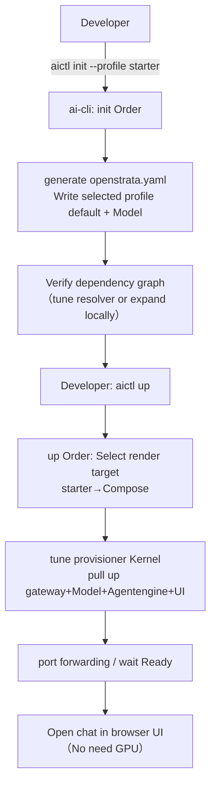
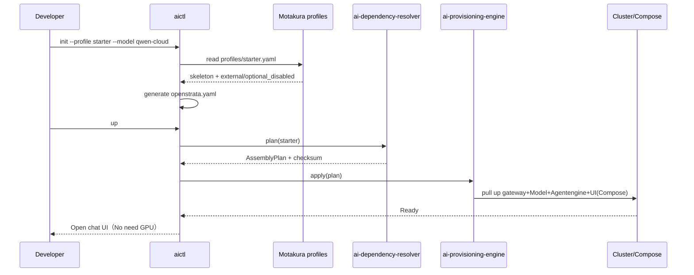

#ai-cli · Detailed design

> **repo**: ai-cli
> **Language · Framework**: Go · Cobra + Wire (DDD four layers; CLI single binary)
> **Field**: developer-tooling (developer tool chain)
> **optional**: false (core · core, developer entrance)
> **Platform version**: v1.4.0
> **Document Status**: Draft
> **Responsible Person**: OpenStrata Architecture Group
> **Associated links**: This repository [arch/ARCH.md](../../arch/ARCH.md) · [skills/SKILLS.md](../../skills/SKILLS.md) · [specs/SPECS.md](../../specs/SPECS.md); Architecture design document §4.1.3 (SDK and CLI · aictl) · §13.4 (One-click early adopter) · §12.2 (Four-level prefabrication) · §13.3 (Assembly arrangement) · §15.5 (DDD layering/Cobra) · §16 (BOM)

---

## 1. Positioning and Boundary (Scope)

`ai-cli` (binary name `aictl`) is OpenStrata's unified command line entrance for **developers and automation**, carrying §4.1.3 "CLI (Go/Cobra)" and §13.4 "One-click early adopters". It converges "local development/debugging" and "interaction with the platform (assembly, deployment, evaluation, configuration)" into one command plane, shielding upper-level users from all underlying operations except the boot portal.

- **The only problem solved by this repository**: Let developers use one command to complete "launch the platform from 0 → manage model/application → run evaluation → change configuration → trigger automatic upgrade" without having to manually spell Helm Values ​​or understand the nine-layer architecture.
- **Required**: core (§4.1.3). It is the user entrance for "doing automation"; it has three types of access methods in parallel with the low-code workbench (business personnel) and SDK (writing code).
- **Division of labor with other Go components**:
- **vs ai-gateway-core / ai-tool-registry and other runtimes**: CLI is their **caller/driver** and does not go through the runtime data plane through CLI; CLI interacts through their exposed API/control plane.
- **vs ai-dependency-resolver / ai-provisioning-engine**: CLI's `plan`/`up`/`apply`/`rollback` subcommands transparently call the kernel of both (§13.3 Assembly link).
- **vs ai-sdk-go**: SDK is a library embedded in host applications; CLI is an independent executable. Both consume `Gateway`/`LLMProvider` SPI but in different forms.

---

## 2. Responsibilities List

| # | Responsibilities | Required/Optional | Description |
| --- | --- | --- | --- |
| R1 | Bootstrap initialization | core | `aictl init --profile starter --model qwen-cloud` (§13.4) |
| R2 | One-click pull up | core | `aictl up`: Compose/K8s pull up core components (§13.4) |
| R3 | Assembly arrangement pass-through | core | `plan`/`apply`/`rollback` → resolver/provisioner (§13.3) |
| R4 | Model management | core | List/enable/disable model suppliers (docking gateway) |
| R5 | Application deployment | core | Deploy/debug Agent (connected to ai-platform-api) |
| R6 | Evaluation task | optional | Submit/query evaluation task (interconnected with ai-eval-service, §4.6) |
| R7 | configuration management | core | read and write PlatformManifest (openstrata.yaml, §12.1) |
| R8 | Local debugging | core | Minimum local runtime, port forwarding, log tracking |

---

## 3. Core abstraction and interface (core interfaces / type definition)

The CLI is organized into **Cobra command tree** + **application layer use cases** (§15.5.2); commands do not directly depend on specific services and are called via domain Port.

```go
package domain

//Command context: aggregate the capability ports of this call
type CLIContext struct {
    Profile   string // starter|standard|advanced|full
    Manifest  ManifestRef
    Endpoint  string //Platform control plane address (local or remote)
}

//Port for interacting with the platform (the anti-corruption layer is implemented in infrastructure)
type PlatformClient interface {
    Init(ctx context.Context, profile, model string) error
    Up(ctx context.Context, profile string) error
    Plan(ctx context.Context, enable []string, tenant string) (string, error) //Return checksum
    Apply(ctx context.Context, checksum string) error
    Rollback(ctx context.Context, component string) error
    ListModels(ctx context.Context) ([]ModelView, error)
    DeployApp(ctx context.Context, specPath string) error
    RunEval(ctx context.Context, taskPath string) (string, error)
}

type ModelView struct {
    ModelID string
    Source  string
    Enabled bool
    Health  string
}

//The Cobra command only does parameter parsing + platformclient adjustment, without business rules.
```

---

## 4. Processing pipeline/request path

Take `aictl init --profile starter --model qwen-cloud && aictl up` as an example (§13.4):



> There are two paths for local development and platform interaction: local debugging through `up` (Compose stand-alone); remote interaction through `plan/apply/rollback` (connected to resolver/provisioner, §13.3).

---

## 5. Key algorithm/logic

### 5.1 Guided initialization
`init` reads the `openstrata-meta/profiles/<profile>.yaml` skeleton (§12.2), merges the user `--model` selection, and generates `openstrata.yaml` (PlatformManifest). Default values ​​come from profile's `external` and `optional_disabled` (§12.2).

### 5.2 Pull up with one click
`up` Select the rendering target according to the profile: starter→Docker Compose; standard+/advanced/full→Helm/K8s (via provisioner kernel). After completion, automatically port forward and detect Ready (§13.4 "Pull up within 30 seconds").

### 5.3 Assembly pass-through
`plan/apply/rollback` forwards the request to `ai-dependency-resolver` / `ai-provisioning-engine` (§13.3), and the CLI is only responsible for parameter collection, progress display, and result formatting.

### 5.4 Configure reading and writing
When reading and writing `openstrata.yaml`, perform schema verification (alignment §12.1). If it is illegal, an error will be reported to avoid dirty configuration delivery.

---

## 6. Adaptation with external systems/components (OSS/SPI Adapter)

| SPI port | Role of this repository | External components | Default ✅ / Alternative | Adapter |
| --- | --- | --- | --- | --- |
| `PlatformClient` | Caller | `ai-dependency-resolver` / `ai-provisioning-engine` / `ai-platform-api` / `ai-gateway-core` | ✅ | HTTP/gRPC Client Adapter |
| `Gateway` (1.2.0) | Caller | Higress (core, data plane) | ✅ | `GatewayClient` (OpenAI-compatible) |
| `LLMProvider` (1.0.0) | Indirect | Each model supplier | ✅ | Forwarded via gateway |
| `Cache` (1.0.0) | Consumer | Redis (core) | ✅ | Local state/cache |
| `Tracing` (1.0.0) | Consumer | OTel (core) | ✅ | CLI operation trace |

> The CLI itself has no runtime OSS dependency**; all capabilities are accessed through the anti-corrosion layer client Adapter (§15.5.4). Aligned with bom.yaml `interface_versions`: `Gateway: 1.2.0`, `LLMProvider: 1.0.0`. `aictl` is §4.1.3's explicit developer access method, alongside SDK/low-code.

---

## 7. API / CLI / Configuration interface

### 7.1 Command tree (Cobra)
```
aictl init     --profile <starter|standard|advanced|full> --model <qwen-cloud|openai|...>
aictl up       [--profile <p>] [--detach]
aictl plan     --enable <cap>... [--tenant <t>]
aictl apply    --plan <checksum>
aictl rollback --component <name>
aictl model    list | enable | disable <model_id>
aictl app      deploy <spec.yaml> | logs <app> | port-forward <app>
aictl eval     submit <task.yaml> | status <id>
aictl config   get <key> | set <key> <val> | edit
aictl debug    --local            #local minimum runtime
aictl version                    #Print aictl + platform version (§16.1)
```
### 7.2 Configuration fragment (part of this repository `infrastructure/config/`)
```yaml
cli:
  defaultProfile: starter
  metaRepo:
    profilesPath: openstrata-meta/profiles
  platform:
    endpoint: http://localhost:8080 # After local up
  output: table                       # table|json|yaml
```
### 7.3 Exit code convention
`0` success; `1` general error; `2` configuration/parameter error; `3` platform not ready; `4` assembly conflict (from resolver).

---

## 8. Data model and storage

- **Local status**: `~/.openstrata/` stores the current profile, `openstrata.yaml` reference, recent Plan checksum, and token.
- **Remote Status**: The configuration/evaluation/deployment status is stored in the corresponding server (PostgreSQL, etc.), and the CLI does not hold authoritative data.
- **No persistent business data**: CLI is stateless executable.

---

## 9. Concurrency and performance (goroutine / pool / back pressure)

- **Framework**: Cobra (§15.5.1), single binary, no persistent service.
- **Concurrency**: `up` waits in parallel for Ready (goroutine + WaitGroup) when pulling up multiple components; `model list`, etc. can hit multiple endpoints in parallel.
- **Backpressure/Cancel**: All commands support `context` + `Ctrl-C` for graceful cancellation; `up` reports an error after timeout (default 30s ready wait, §13.4) and retains part of the status for troubleshooting.
- **Resources**: CLI itself is extremely low-consuming (cpu 50m / mem 32Mi running time); re-activation is performed on the remote end.

---

## 10. Key sequence diagram (Mermaid)



---

## 11. Configuration and deployment (including K8s resources/probes)

- **Distribution form**: single binary, multi-platform executable output through `ai-cli` repository CI (`make build` / package management release); non-K8s workload, no probe.
- **Local development**: `go run ./cmd/aictl`; publish `go install github.com/openstrata/ai-cli/cmd/aictl@v1.4.0` (§16.1 tag).
- **Linkage with the platform**: `up` uses Compose through the starter (§9.1 deployment form); standard+/advanced/full uses K8s/ArgoCD through the provisioner (§12.2).
- **Version Alignment**: `aictl version` output is consistent with `openstrata v1.4.0` + individual SPI `interface_versions` (§16.1).

---

## 12. Observability / Security

- **Observability (§4.8)**: CLI operations are reported via OTel (core basic trace); `--verbose` prints request/response summary; operation audit is recorded by the server (§13.5).
- **Security (§4.7.3 / §4.7.4)**: CLI supports platform API Token (K8s Secret/Vault, no clear text); `config set` writes local encrypted storage; multi-user scenarios are authenticated by Keycloak (§4.7.3); basic risk control (rate limiting) restricts CLI calls on the gateway side.

---

## 13. Testing strategy

- **Unit test**: parameter analysis, profile merging, and manifest verification of each command (pure logic at the domain layer, §15.5.5).
- **Integration Test**: `init` outputs `openstrata.yaml` consistent with the profile skeleton; `plan` connects to the resolver test pile and returns the expected checksum.
- **End-to-end (golden path)**: `aictl init --profile starter && aictl up` in CI starts the core component in kind/Compose and asserts that the chat UI is reachable (§13.4 30s target).
- **Contract Test**: `GatewayClient`/`PlatformClient` Adapter runs contract use cases (§10.4) on the gateway/control plane API to ensure consistency among multiple implementations.
- **Regression**: After bom.yaml version bump, `aictl version` and `model list` display are updated synchronously.

---

## 14. Open questions

1. **Capability equivalence between CLI and portal**: Does the CLI need to expose everything that the portal can do (such as dual-writing canary cutover of vector libraries libraries)? Or does the CLI only do the subset commonly used by developers?
2. **Local multi-profile switching**: Developers can experiment with starter and advanced locally at the same time. How can the status directories be isolated to avoid mutual contamination?
3. **CLI-triggered remote assembly permissions**: `aictl apply` changes the running state through resolver/provisioner. Who enforces its authentication/RBAC (ai-platform-api?).
4. **Offline/air isolation environment**: How does the CLI pull the metacang profiles and bom (local cache policy) when there is no external network?
5. **Evaluation subcommand ownership**: Should `aictl eval` be a formal CLI command, or only a full file/optional (§4.6 Evaluation optional)?

---

## Change record

| Version | Date | Author | Description |
| --- | --- | --- | --- |
| v0.1 | 2026-07-17 | OpenStrata Architecture Group | First draft (covering the placeholder skeleton, complete with 14 sections) |

## Traceability Matrix (Chapter of this document ↔ Architecture Design Document § Number)

| Chapter | Corresponding Architecture § |
| --- | --- |
| 1 Positioning and Boundaries | §4.1.3, §13.4, §15.5 |
| 2 Responsibilities List | §4.1.3, §4.6, §13.3, §13.4 |
| 3 Core abstractions and interfaces | §13.3, §15.5.2 |
| 4 Processing Pipeline | §13.4 |
| 5 Key Algorithms | §12.1, §12.2, §13.3, §13.4 |
| 6 External adaptation | §4.1.3, §10.4, §15.5.4, §16 |
| 7 API/CLI/Configuration | §4.1.3, §12.1, §12.2, §13.4 |
| 8 Data Model | §12.1, §16(base) |
| 9 Concurrency and Performance | §13.4, §15.5.1 |
| 10 Timing diagram | §13.4, §15.5.2.2 |
| 11 Configuration Deployment | §9.1, §12.2, §16.1 |
| 12 Observability/Security | §4.7.3, §4.7.4, §4.8, §13.5 |
| 13 Testing Strategy | §10.4, §13.4, §15.5.5 |
| 14 Open Questions | §4.6, §10.4, §12.1, §13.3 |
